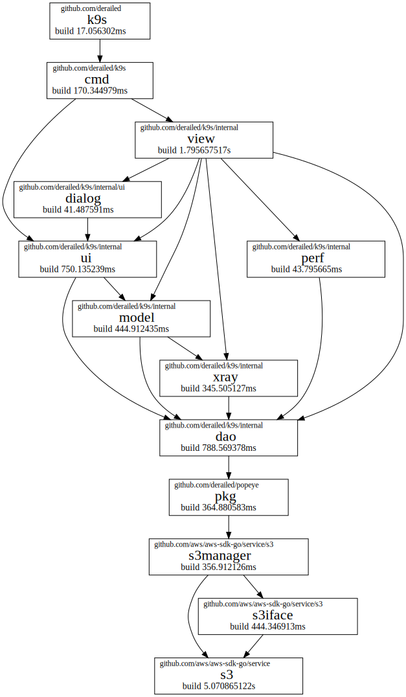
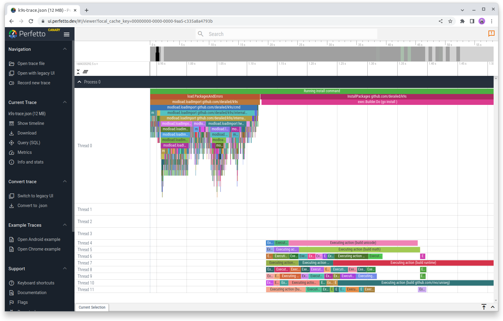

# actiongraph

`actiongraph` is a CLI for investigating where `go build` is spending its time
compiling. It consumes the file written using the compile.json output by `go
build -debug-actiongraph=compile.json`, which includes information about compile
steps and dependencies between packages.

`actiongraph` can help you identify which packages take a lot of compilation
time with `top`, summarise where that time is spent with `tree`, and identify
where the dependencies come from with `graph --why`.

Alongside the `-debug-actiongraph` flag is the `-debug-trace` flag which this
program does not use, but is a similarly instructive tool which can help you
identify parallelism and build order. For completeness, it is also shown below.

## Installation

    go install github.com/unravelin/actiongraph@latest

## Usage overview

    # Optionally clear your go build cache, if you're wanting to understanding why
    # a build in CI is taking a while (depending on its cache reuse):
    go clean -cache

    # Compile your program using the undocumented -debug-actiongraph flag:
    go build -debug-actiongraph=compile.json ./my-prog

    # Show the slowest individual packages:
    actiongraph top -f compile.json

    # Show aggregate time spent compiling nested packages:
    actiongraph tree -f compile.json

    # Show aggregate time spent compiling github packages:
    actiongraph tree -f compile.json -L 2 github.com

    # Render dependency diagrams of packages, focusing on why PKG was compiled in:
    actiongraph graph --why PKG -f compile.json > compile-pkg.dot
    dot -Tsvg -Grankdir=LR < compile-pkg.dot > compile-pkg.svg

## Worked example

In this example, we're going to look inside one of @unravelin's favourite CLIs,
https://k9scli.io/.

First, let's check that we're all set up:

    go version
    actiongraph -h

then create our demo space:

    mkdir demo
    cd demo

We want to investigate a fresh build, so let's clear the build cache:

    go clean -cache

Now we compile. We're going to specify body `-debug-actiongraph` and `-debug-trace` here so we can compare the results. (And we're going to send the compiled binary into a temporary directory.)

    GOBIN=$(mktemp -d) go install -debug-actiongraph=k9s.json -debug-trace=k9s-trace.json github.com/derailed/k9s@v0.27.4

We should have a new file called `k9s.json` describing the actiongraph. Let's take a look at the first few entries `jq '.[:5] | .[]' -c < k9s.json`:

    {"ID":0,"Mode":"go install","Package":"","Deps":[1],"Priority":1190,"TimeReady":"2023-05-12T09:24:39.647607494+01:00","TimeStart":"2023-05-12T09:24:39.647610965+01:00","TimeDone":"2023-05-12T09:24:39.647611018+01:00","Cmd":null}
    {"ID":1,"Mode":"link-install","Package":"github.com/derailed/k9s","Deps":[2],"Objdir":"/tmp/go-build3966251150/b001/","Target":"/tmp/tmp.WIZyR7yX3Y/k9s","Priority":1189,"Built":"/tmp/tmp.WIZyR7yX3Y/k9s","BuildID":"LZKyYv0RT8N-_YjcRQ1R/PsuartwNDnqAz2PYjtcW/lvWIs0IgoEnXVRitK8yx/ClYoHVGOEFtTZ-Gnzq2h","TimeReady":"2023-05-12T09:24:39.647340894+01:00","TimeStart":"2023-05-12T09:24:39.647348289+01:00","TimeDone":"2023-05-12T09:24:39.647607252+01:00","Cmd":null}
    {"ID":2,"Mode":"link","Package":"github.com/derailed/k9s","Deps":[3,4,5,6,7,8,9,10,11,12,13,14,15,16,17,18,19,20,21,22,23,24,25,26,27,28,29,30,31,32,33,34,35,36,37,38,39,40,41,42,43,44,45,46,47,48,49,50,51,52,53,54,55,56,57,58,59,60,61,62,63,64,65,66,67,68,69,70,71,72,73,74,75,76,77,78,79,80,81,82,83,84,85,86,87,88,89,90,91,92,93,94,95,96,97,98,99,100,101,102,103,104,105,106,107,108,109,110,111,112,113,114,115,116,117,118,119,120,121,122,123,124,125,126,127,128,129,130,131,132,133,134,135,136,137,138,139,140,141,142,143,144,145,146,147,148,149,150,151,152,153,154,155,156,157,158,159,160,161,162,163,164,165,166,167,168,169,170,171,172,173,174,175,176,177,178,179,180,181,182,183,184,185,186,187,188,189,190,191,192,193,194,195,196,197,198,199,200,201,202,203,204,205,206,207,208,209,210,211,212,213,214,215,216,217,218,219,220,221,222,223,224,225,226,227,228,229,230,231,232,233,234,235,236,237,238,239,240,241,242,243,244,245,246,247,248,249,250,251,252,253,254,255,256,257,258,259,260,261,262,263,264,265,266,267,268,269,270,271,272,273,274,275,276,277,278,279,280,281,282,283,284,285,286,287,288,289,290,291,292,293,294,295,296,297,298,299,300,301,302,303,304,305,306,307,308,309,310,311,312,313,314,315,316,317,318,319,320,321,322,323,324,325,326,327,328,329,330,331,332,333,334,335,336,337,338,339,340,341,342,343,344,345,346,347,348,349,350,351,352,353,354,355,356,357,358,359,360,361,362,363,364,365,366,367,368,369,370,371,372,373,374,375,376,377,378,379,380,381,382,383,384,385,386,387,388,389,390,391,392,393,394,395,396,397,398,399,400,401,402,403,404,405,406,407,408,409,410,411,412,413,414,415,416,417,418,419,420,421,422,423,424,425,426,427,428,429,430,431,432,433,434,435,436,437,438,439,440,441,442,443,444,445,446,447,448,449,450,451,452,453,454,455,456,457,458,459,460,461,462,463,464,465,466,467,468,469,470,471,472,473,474,475,476,477,478,479,480,481,482,483,484,485,486,487,488,489,490,491,492,493,494,495,496,497,498,499,500,501,502,503,504,505,506,507,508,509,510,511,512,513,514,515,516,517,518,519,520,521,522,523,524,525,526,527,528,529,530,531,532,533,534,535,536,537,538,539,540,541,542,543,544,545,546,547,548,549,550,551,552,553,554,555,556,557,558,559,560,561,562,563,564,565,566,567,568,569,570,571,572,573,574,575,576,577,578,579,580,581,582,583,584,585,586,587,588,589,590,591,592,593,594,595,596,597,598,599,600,601,602,603,604,605,606,607,608,609,610,611,612,613,614,615,616,617,618,619,620,621,622,623,624,625,626,627,628,629,630,631,632,633,634,635,636,637,638,639,640,641,642,643,644,645,646,647,648,649,650,651,652,653,654,655,656,657,658,659,660,661,662,663,664,665,666,667,668,669,670,671,672,673,674,675,676,677,678,679,680,681,682,683,684,685,686,687,688,689,690,691,692,693,694,695,696,697,698,699,700,701,702,703,704,705,706,707,708,709,710,711,712,713,714,715,716,717,718,719,720,721,722,723,724,725,726,727,728,729,730,731,732,733,734,735,736,737,738,739,740,741,742,743,744,745,746,747,748,749,750,751,752,753,754,755,756,757,758,759,760,761,762,763,764,765,766,767,768,769,770,771,772,773,774,775,776,777,778,779,780,781,782,783,784,785,786,787,788,789,790,791,792,793,794,795,796,797,798,799,800,801,802,803,804,805,806,807,808,809,810,811,812,813,814,815,816,817,818,819,820,821,822,823,824,825,826,827,828,829,830,831,832,833,834,835,836,837,838,839,840,841,842,843,844,845,846,847,848,849,850,851,852,853,854,855,856,857,858,859,860,861,862,863,864,865,866,867,868,869,870,871,872,873,874,875,876,877,878,879,880,881,882,883,884,885,886,887,888,889,890,891,892,893,894,895,896,897,898,899,900,901,902,903,904,905,906,907,908,909,910,911,912,913,914,915,916,917,918,919,920,921,922,923,924,925,926,927,928,929,930,931,932,933,934,935,936,937,938,939,940,941,942,943,944,945,946,947,948,949,950,951,952,953,954,955,956,957,958,959,960,961,962,963,964,965,966,967,968,969,970,971,972,973,974,975,976,977,978,979,980,981,982,983,984,985,986,987,988,989,990,991,992,993,994,995,996,997,998,999,1000,1001,1002,1003,1004,1005,1006,1007,1008,1009,1010,1011,1012,1013,1014,1015,1016,1017,1018,1019,1020,1021,1022,1023,1024,1025,1026,1027,1028,1029,1030,1031,1032,1033,1034,1035,1036,1037,1038,1039,1040,1041,1042,1043,1044,1045,1046,1047,1048,1049,1050,1051,1052,1053,1054,1055,1056,1057,1058,1059,1060,1061,1062,1063,1064,1065,1066,1067,1068,1069,1070,1071,1072,1073,1074,1075,1076,1077,1078,1079,1080,1081,1082,1083,1084,1085,1086,1087,1088,1089,1090,1091,1092,1093,1094,1095,1096,1097,1098,1099,1100,1101,1102,1103,1104,1105,1106,1107,1108,1109,1110,1111,1112,1113,1114,1115,1116,1117,1118,1119,1120,1121,1122,1123,1124,1125,1126,1127,1128,1129,1130,1131,1132,1133,1134,1135,1136,1137,1138,1139,1140,1141,1142,1143,1144,1145,1146,1147,1148,1149,1150,1151,1152,1153,1154,1155,1156,1157,1158,1159,1160,1161,1162,1163,1164,1165,1166,1167,1168,1169,1170,1171,1172,1173,1174,1175,1176,1177,1178,1179,1180,1181,1182,1183,1184,1185,1186,1187,1188],"Objdir":"/tmp/go-build3966251150/b001/","Target":"/tmp/go-build3966251150/b001/exe/a.out","Priority":1188,"Built":"/tmp/go-build3966251150/b001/exe/a.out","ActionID":"LZKyYv0RT8N-_YjcRQ1R","BuildID":"LZKyYv0RT8N-_YjcRQ1R/PsuartwNDnqAz2PYjtcW/lvWIs0IgoEnXVRitK8yx/ClYoHVGOEFtTZ-Gnzq2h","TimeReady":"2023-05-12T09:24:33.62117428+01:00","TimeStart":"2023-05-12T09:24:33.621181576+01:00","TimeDone":"2023-05-12T09:24:39.647340491+01:00","Cmd":["/home/icio/sdk/go/pkg/tool/linux_amd64/link -o /tmp/go-build3966251150/b001/exe/a.out -importcfg /tmp/go-build3966251150/b001/importcfg.link -X=runtime.godebugDefault=panicnil=1 -buildmode=exe -buildid=LZKyYv0RT8N-_YjcRQ1R/PsuartwNDnqAz2PYjtcW/lvWIs0IgoEnXVRitK8yx/LZKyYv0RT8N-_YjcRQ1R -extld=gcc /tmp/go-build3966251150/b001/_pkg_.a"],"CmdReal":5757072143,"CmdUser":6457235000,"CmdSys":853740000}
    {"ID":3,"Mode":"build","Package":"github.com/derailed/k9s","Deps":[4,5,6,7,8,1189],"Objdir":"/tmp/go-build3966251150/b001/","Priority":1187,"NeedBuild":true,"ActionID":"PsuartwNDnqAz2PYjtcW","BuildID":"PsuartwNDnqAz2PYjtcW/lvWIs0IgoEnXVRitK8yx","TimeReady":"2023-05-12T09:24:33.604116889+01:00","TimeStart":"2023-05-12T09:24:33.604117711+01:00","TimeDone":"2023-05-12T09:24:33.621174013+01:00","Cmd":["/home/icio/sdk/go/pkg/tool/linux_amd64/compile -o /tmp/go-build3966251150/b001/_pkg_.a -trimpath \"/tmp/go-build3966251150/b001=>\" -p main -lang=go1.20 -complete -buildid PsuartwNDnqAz2PYjtcW/PsuartwNDnqAz2PYjtcW -c=4 -nolocalimports -importcfg /tmp/go-build3966251150/b001/importcfg -pack /home/icio/go/pkg/mod/github.com/derailed/k9s@v0.27.4/main.go"],"CmdReal":15611237,"CmdUser":16273000}
    {"ID":4,"Mode":"build","Package":"flag","Deps":[9,10,11,12,13,14,8,15,16,17,18],"Objdir":"/tmp/go-build3966251150/b002/","Priority":44,"NeedBuild":true,"ActionID":"fhRdV7jbdbpj3WwhqK7M","BuildID":"fhRdV7jbdbpj3WwhqK7M/fpr490Yv8t_PFttE-9YV","TimeReady":"2023-05-12T09:23:48.146874388+01:00","TimeStart":"2023-05-12T09:23:48.146904614+01:00","TimeDone":"2023-05-12T09:23:48.29620602+01:00","Cmd":["/home/icio/sdk/go/pkg/tool/linux_amd64/compile -o /tmp/go-build3966251150/b002/_pkg_.a -trimpath \"/tmp/go-build3966251150/b002=>\" -p flag -std -complete -buildid fhRdV7jbdbpj3WwhqK7M/fhRdV7jbdbpj3WwhqK7M -c=4 -nolocalimports -importcfg /tmp/go-build3966251150/b002/importcfg -pack /home/icio/sdk/go/src/flag/flag.go"],"CmdReal":140280033,"CmdUser":144616000,"CmdSys":22834000}

So let's find the compile steps that took the longest:

    $ actiongraph -f k9s.json top
      9.016s   2.75%  build k8s.io/api/core/v1
      6.026s   4.59%  link  github.com/derailed/k9s
      5.071s   6.13%  build github.com/aws/aws-sdk-go/service/s3
      3.620s   7.23%  build github.com/aws/aws-sdk-go/aws/endpoints
      3.474s   8.29%  build net/http
      3.215s   9.27%  build net
      2.869s  10.15%  build github.com/google/gnostic/openapiv2
      2.846s  11.02%  build github.com/google/gnostic/openapiv3
      2.581s  11.80%  build k8s.io/apimachinery/pkg/apis/meta/v1
      2.476s  12.56%  build google.golang.org/protobuf/internal/impl
      2.186s  13.22%  build github.com/gogo/protobuf/proto
      1.974s  13.83%  build k8s.io/api/extensions/v1beta1
      1.919s  14.41%  build github.com/derailed/tview
      1.898s  14.99%  build k8s.io/apiextensions-apiserver/pkg/apis/apiextensions/v1beta1
      1.840s  15.55%  build github.com/klauspost/compress/zstd
      1.796s  16.10%  build github.com/derailed/k9s/internal/view
      1.671s  16.61%  build k8s.io/kubectl/pkg/describe
      1.658s  17.11%  build github.com/prometheus/procfs
      1.624s  17.61%  build k8s.io/api/apps/v1
      1.596s  18.09%  build runtime

By default, `actiongraph top` will show the 20 slowest steps. This may be
overridden using the `-n0` flag. For example, to get the fastest steps we could
check:

    $ actiongraph -f k9s.json top -n0 | tail -5
      0.006s 100.00%  build google.golang.org/protobuf/internal/flags
      0.000s 100.00%  link-install  github.com/derailed/k9s
      0.000s 100.00%  nop
      0.000s 100.00%  built-in package      unsafe
      0.000s 100.00%  go install

Here we can see that the second column is showing the cumulative percentage of
time spent up to that package.

We can summarise the time spent within package domain/directories using the
`tree` subcommand:

    $ actiongraph -f k9s.json tree -L 1
    322.013s          (root)
    154.673s            k8s.io
     83.357s            github.com
     40.294s            std
     12.338s            sigs.k8s.io
     10.886s            golang.org
      7.178s            google.golang.org
      5.413s            helm.sh
      2.428s            gopkg.in
      2.344s            go.starlark.net
      1.702s            go.opentelemetry.io
      1.400s            oras.land

We can see that we spent 322 seconds compiling k9s, though some of that compilation would have happened in parallel, and so the

We've rolled up all standard libraries under `std`:

    $ actiongraph -f k9s.json tree encoding
    322.013s          (root)
     40.294s            std
      1.942s   0.017s     std/encoding
      0.572s   0.572s       std/encoding/json
      0.564s   0.564s       std/encoding/xml
      0.207s   0.207s       std/encoding/asn1
      0.192s   0.192s       std/encoding/binary
      0.096s   0.096s       std/encoding/csv
      0.080s   0.080s       std/encoding/hex
      0.074s   0.074s       std/encoding/base64
      0.073s   0.073s       std/encoding/pem
      0.067s   0.067s       std/encoding/base32

Let's look at which github repos are taking the longest to compile:

    $ actiongraph -f k9s.json tree github.com -L 2 | head -15
    322.013s          (root)
     83.357s            github.com
     17.307s              github.com/aws
     17.307s                github.com/aws/aws-sdk-go
     16.360s              github.com/derailed
      7.674s   0.017s       github.com/derailed/k9s
      4.517s                github.com/derailed/popeye
      2.250s                github.com/derailed/tcell
      1.919s   1.919s       github.com/derailed/tview
      8.206s              github.com/google
      6.524s                github.com/google/gnostic
      1.014s                github.com/google/go-cmp
      0.277s   0.277s       github.com/google/btree
      0.163s   0.115s       github.com/google/gofuzz
      0.150s   0.150s       github.com/google/uuid

We saw from `top` that package github.com/aws/aws-sdk-go/service/s3 was one of the slowest to compile. To understand why, we're going to use the `graph` subcommand which can filter down the dependency list to highlight all import paths leading from our build target to the package indicated by `--why PKG`:

    actiongraph -f k9s.json graph --why github.com/aws/aws-sdk-go/service/s3 > k9s-s3.dot

and then render it using [Graphviz](https://graphviz.org/)'s `dot`:

    dot -Tsvg < k9s-s3.dot > k9s-s3.svg

which looks something like this:

Lastly we can open our k9s-trace.json in https://ui.perfetto.dev/ or Google
Chrome/Chromium's chrome://tracing. This shows us how successfully the scheduler
utilises the multiple cores on our machine when compiling each package:

